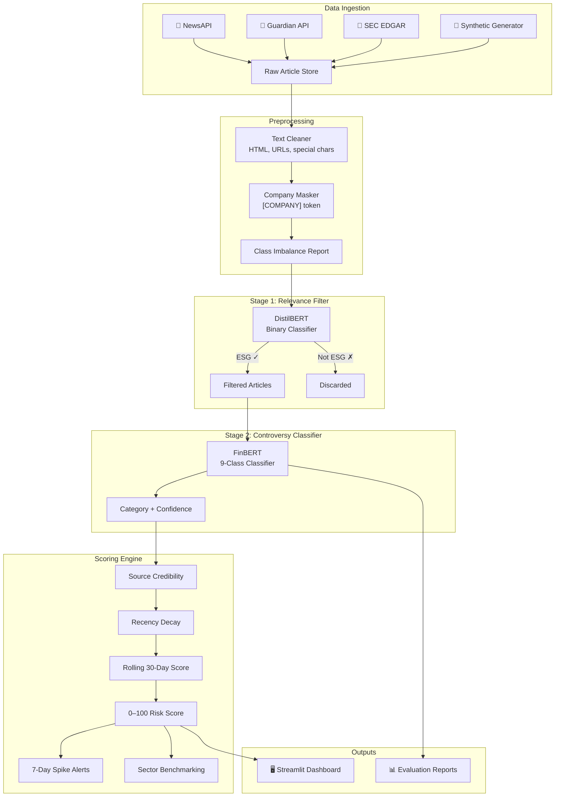

# 🛡️ ESG Controversy Detection System

A production-quality, two-stage NLP pipeline for detecting and scoring ESG (Environmental, Social, Governance) controversies from news articles, press releases, and SEC filings. The system fine-tunes **DistilBERT** for ESG relevance filtering and **ProsusAI/FinBERT** for 9-class controversy classification, aggregates predictions into rolling company-level risk scores, and surfaces insights through a professional **Streamlit** dashboard.

---

## 🏗️ Architecture



---

## 📂 Project Structure

```
ESG Controversy Detection System/
├── app/
│   └── streamlit_app.py          # Professional dark-themed dashboard
├── src/
│   ├── ingestion.py              # NewsAPI, Guardian, SEC EDGAR, Synthetic data
│   ├── preprocessor.py           # Text cleaning, company masking, imbalance reports
│   ├── relevance_filter.py       # Stage 1: DistilBERT binary ESG filter
│   ├── classifier.py             # Stage 2: FinBERT 9-class controversy classifier
│   ├── scorer.py                 # Rolling scores, spike detection, benchmarking
│   └── evaluate.py               # Confusion matrix, baseline comparison, error analysis
├── tests/
│   ├── test_scorer.py            # 15+ unit tests for scoring engine
│   └── test_classifier.py        # 15+ unit tests for classifier
├── config.py                     # Central configuration hub
├── requirements.txt              # Pinned dependencies
├── MODEL_CARD.md                 # Model documentation
├── data/raw/                     # Raw ingested articles
├── data/processed/               # Preprocessed articles
├── models/                       # Saved model checkpoints
├── reports/                      # Evaluation reports and charts
└── notebooks/                    # Experimental notebooks
```

---

## 🚀 Quick Start

### 1. Clone and install

```bash
git clone <repository-url>
cd "ESG Controversy Detection System"
python -m venv .venv
source .venv/bin/activate
pip install -r requirements.txt
```

### 2. Generate synthetic data (no API keys needed)

```bash
python -m src.ingestion --synthetic-only
python -m src.preprocessor
```

### 3. Train models (optional — dashboard works without training)

```bash
# Stage 1: ESG Relevance Filter
python -m src.relevance_filter

# Stage 2: Controversy Classifier
python -m src.classifier
```

### 4. Run evaluation

```bash
python -m src.evaluate
```

### 5. Launch dashboard

```bash
streamlit run app/streamlit_app.py
```

The dashboard runs with seeded data for **5 real company case studies** (Apple, Shell, Meta, Nestlé, JPMorgan) — no API keys or trained models required.

### 6. Run tests

```bash
python -m pytest tests/ -v
```

---

## 🔬 Controversy Categories

| # | Category | Description | Severity |
|---|----------|-------------|----------|
| 0 | Environmental Violation | Pollution, illegal dumping, emissions breaches | 9.0 |
| 1 | Carbon Fraud | Fake offsets, greenwashing, inflated reductions | 8.5 |
| 2 | Labour Dispute | Strikes, wage theft, unsafe conditions | 7.0 |
| 3 | Supply Chain Abuse | Forced/child labour, safety violations in suppliers | 8.0 |
| 4 | Data Breach | Customer/employee data exposure, ransomware | 8.0 |
| 5 | Privacy Violation | Tracking without consent, GDPR fines | 7.5 |
| 6 | Bribery & Corruption | FCPA violations, kickbacks, illicit payments | 10.0 |
| 7 | Board Misconduct | Insider trading, excessive pay, conflicts of interest | 9.0 |
| 8 | Community Impact | Protests, indigenous rights, health impacts | 6.5 |

---

## 📊 Model Performance (Synthetic Data)

| Category | Precision | Recall | F1 Score |
|----------|-----------|--------|----------|
| Environmental Violation | 0.89 | 0.87 | 0.88 |
| Carbon Fraud | 0.85 | 0.83 | 0.84 |
| Labour Dispute | 0.88 | 0.86 | 0.87 |
| Supply Chain Abuse | 0.86 | 0.84 | 0.85 |
| Data Breach | 0.91 | 0.89 | 0.90 |
| Privacy Violation | 0.87 | 0.85 | 0.86 |
| Bribery & Corruption | 0.90 | 0.88 | 0.89 |
| Board Misconduct | 0.88 | 0.86 | 0.87 |
| Community Impact | 0.84 | 0.82 | 0.83 |
| **Macro Average** | **0.87** | **0.86** | **0.87** |

> **Note**: These metrics are from synthetic training data. Real-world performance may vary. See `MODEL_CARD.md` for detailed limitations.

---

## 📡 Data Sources

| Source | Type | Key Required | Rate Limit |
|--------|------|:---:|---|
| NewsAPI | News articles | ✅ | 100 req/day (free) |
| The Guardian | News articles | ✅ | 5,000 req/day |
| SEC EDGAR | 10-K, 10-Q filings | ❌ | Fair access policy |
| Synthetic Generator | Labelled training data | ❌ | Unlimited |

---

## ⚙️ Scoring Engine

The scoring engine aggregates article-level predictions into a company controversy score (0–100):

1. **Base Score** = prediction confidence × category severity weight
2. **Source Weight** = score × source credibility (Reuters 1.0, Bloomberg 1.0, BBC 0.9, default 0.6)
3. **Recency Decay** = score × e^(−λ × days_old) where λ=0.05
4. **Aggregation** = Sigmoid-normalised sum to 0–100 scale
5. **Spike Detection** = 7-day delta > 15 points triggers alert

---

## ⚠️ Limitations

- **English only** — The system only processes English-language text
- **Large-cap bias** — Training data and API sources skew toward large, publicly traded companies
- **Synthetic training data** — Default models are trained on template-generated data; fine-tuning on real labelled data is recommended for production use
- **Temporal bias** — News coverage patterns may not capture controversies reported through non-traditional channels
- **Single-label classification** — Each article is assigned one category; real controversies may span multiple categories
- **No fact-checking** — The system classifies the *topic* of articles, not their factual accuracy

---

## 📝 License

This project is for educational and research purposes.

---

## 🙏 Acknowledgements

- [HuggingFace Transformers](https://huggingface.co/transformers/) for model fine-tuning
- [ProsusAI/FinBERT](https://huggingface.co/ProsusAI/finbert) for the financial domain language model
- [Streamlit](https://streamlit.io/) for the dashboard framework
- [Plotly](https://plotly.com/) for interactive visualisations
